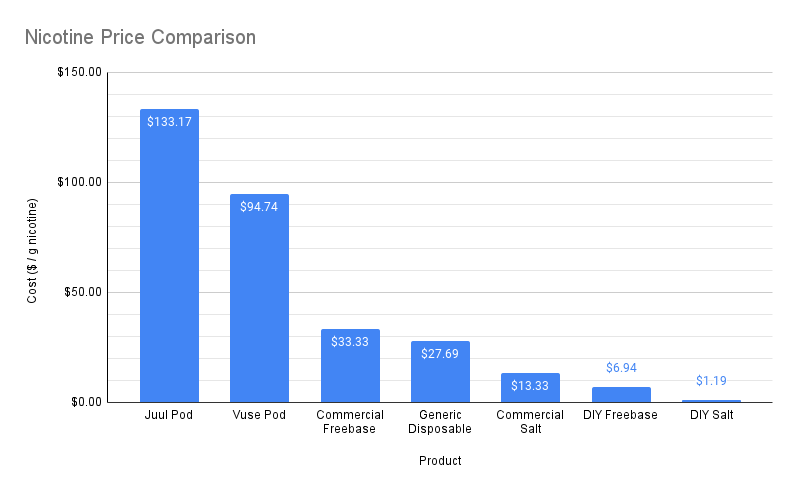

# The Guide To Smoking Cessation

This guide is meant for users of combustible cigarettes. It will help explain the basics of vaping and making your own e-liquid.

## History

The modern e-cigarette was invented in 2003 by a Chinese man named Hon Lik. From 2003 to 2010, the e-cigarette market was small and full of expensive, complicated devices that required constant maintenance.

By 2014, some innovation in the market allowed for the scene to split into a few cliques, with some users preferring more power and bigger clouds ("mod" users), others preferring a more stealthy/discreet setup ("pod" users).

In 2015, things got much more complicated with the introduction of nicotine _salts_, where "normal" freebase nicotine is mixed with an acid to make a type of nicotine which is just as stimulating, but much less harsh on the throat. In the pre-2015 years, freebase nicotine strengths in retail stores varied from 3mg/mL up to about 24mg/mL - anything above that was considered pretty much unvapeable by a human because of how harsh freebase is. When Juul started shipping nicotine salt pods in 2015, they were able to push that number to 59mg/mL - almost 2.5x more nicotine in every puff, and the user was none the wiser because Juul labelled these pods "5% nicotine" instead of the more imposing "59mg/mL."

Between Big Tobacco and Chinese disposable manufacturers who couldn't care less about their users' health, you don't have many good options on the retail market nowadays. And because of Juul's marketing brilliance, before the pandemic we had a "teen vaping epidemic," which resulted in the legal gray area you see today. Lawmakers haven't closed any loopholes to keep unregulated Chinese disposables out of gas stations, but they have acted to completely hamstring the domestic small-medium e-liquid industry, which at least offered users more choice in nicotine levels to give them an "off ramp."

## What Can I Do?

Whether you want to use nicotine salts or freebase, a reliable way to **quit smoking or vaping** is to find a nicotine level that satisfies your cravings, then step your way down to 0mg/mL. Then you can choose whether or not you want to quit vaping at any point without a addictive chemical involved.

## Why DIY?

You may be able to find retail pre-mixed e-liquid depending on where you live, but it may or may only be available in a few strengths. If you were to make the liquid yourself, you could step down at whatever rate you desire. Also, commercial e-liquid is known (in the DIY community) as being oversweetened and overflavored. The reason this is a downside is that it causes you to need to replace coils much more frequently, and could be worse for your health than vaping something you make yourself.

Additionally, if you do a cost analysis DIY blows retail e-liquid out of the water.

## How to DIY

## References

<a id="1">[1]</a>
